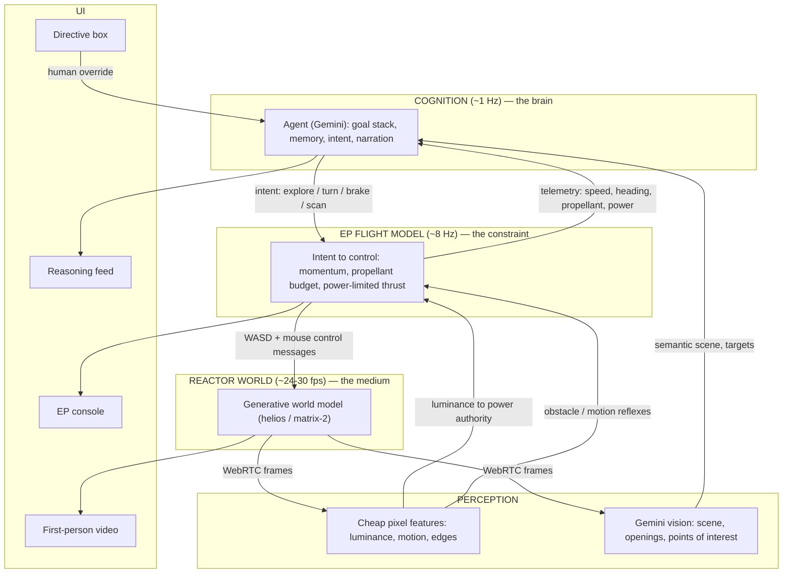

# DRIFT v2 — Project Architecture

**An autonomous probe-agent that explores an alien world dreamed in real time — flying it under the constraints of electric propulsion.**
Built for *Inception* (Launchd × Interact Studio, powered by Reactor), Bengaluru, June 20 2026.
Track: **Agents in Worlds.** Solo build, one day.

---

## 0. What changed from v1, and why

v1 ran a deterministic orbital simulation and used Reactor as scenery. Reactor's real API makes that impossible *and* pointless: you steer Reactor's worlds with **keyboard/mouse and a 6-DoF camera**, frames stream to you over **WebRTC**, and the models generate **first-person navigable worlds** (a car crossing an alien desert, a walk through a park) — not top-down solar systems with orbits. Orbital state has no input path into Reactor, and a deterministic sim is the opposite of what a generative world model is for.

v2 fixes this by giving each piece a role it actually needs the others for:

- **World model = the medium.** An unpredictable, rich world the agent must *perceive and adapt to*. You cannot pre-script it — that is the entire reason to use a world model.
- **Agent = the brain.** Perceive a generated frame → reason → act by issuing the same WASD/mouse a human would.
- **Electric propulsion = the constraint.** A flight-dynamics layer between the agent and Reactor that turns instant game controls into a *heavy, low-thrust, budget-limited* craft: momentum you must anticipate, propellant you must ration, and thrust authority that **drops when the world goes dark** (less light → less solar power). Now the world model's pixels feed back into what the agent is physically able to do.

The signature intellectual move: **EP is the transfer function between the agent's will and Reactor's controls.** "Press W" becomes "I have the power budget to thrust for three seconds, then I coast." That is what makes the agent *plan*, and planning under constraint is the demo.

---

## 1. Concept in one paragraph

DRIFT drops an autonomous probe-agent into a world Reactor generates live. The agent sees each frame through Gemini's eyes, decides where to go, and pilots the craft using Reactor's native controls — but every command passes through an electric-propulsion flight model. Thrust is tiny, so the craft carries momentum and cannot turn or stop abruptly; propellant is finite, so every maneuver is rationed; and available power is read from the **brightness of the generated scene**, so when the agent flies into shadow its thrust authority fades and it must slow down. The viewer watches an agent reason through the brutal economy of electric propulsion inside a world that is itself being dreamed in real time — and can interrupt it with a directive at any moment.

---

## 2. Architecture



| Layer | Rate | Role |
|---|---|---|
| Reactor world model | 24–30 fps | Generates and renders the navigable world; consumes WASD/mouse |
| Perception | pixel ~10 Hz / VLM ~1 Hz | Cheap reflexes from pixels; semantic understanding from Gemini |
| EP flight model | ~8 Hz | Converts intent into constrained control; enforces momentum, propellant, power |
| Cognition (agent) | ~1 Hz | Goals, memory, decisions, narration, human handoff |

**Why two perception paths:** Gemini is too slow and too unreliable on novel generated imagery to drive reflexes. So **cheap pixel features** (mean luminance, optical-flow magnitude, edge density) handle the fast, safety-critical signals — *am I about to hit something, how bright is it here* — while **Gemini** handles slow semantic judgment — *what is that, is it worth approaching*. This split is what makes the loop feasible in real time.

---

## 3. The crux: intent → constrained control

This table is the heart of the build. The agent never presses keys directly; it issues an **intent**, and the EP flight model executes it as a metered stream of Reactor control messages.

| Agent intent | EP flight model behavior | Reactor output |
|---|---|---|
| `ACCELERATE` | If `power` and `propellant` allow: ramp velocity up slowly (low thrust); deplete xenon | repeated `keyboard_key:"W"` ticks while ramping |
| `BRAKE` | Reverse thrust; takes several ticks and **costs propellant** to bleed off momentum | `keyboard_key:"S"` ticks until modeled velocity ≈ 0 |
| `COAST` | Maintain current velocity; **free** (no propellant) — momentum persists | no input; agent must have planned ahead |
| `TURN(dir, deg)` | Attitude authority is limited → apply mouse-look in **small increments over many ticks** | incremental `mouse_key` (e.g. `"H"/"L"` look) per tick |
| `SCAN` | Sweep camera to survey surroundings (cheap, small propellant if reorienting) | mouse-look sweep |
| `HOLD` | Stop issuing inputs; freeze intent | none |

**The dynamics the flight model imposes on top of Reactor:**
```
power_authority = clamp( luminance/255 , 0.15 , 1.0 )          # dark scene -> weak thrust
F_avail = min( F_max , 2*eta*P_max*power_authority / v_e )     # the real EP relation
a = F_avail / mass                                             # tiny -> sluggish
velocity += a*dt   (only while thrusting)                      # momentum: persists when coasting
propellant -= (F_avail / v_e) * dt   (only while thrusting)    # rationed; coasting is free
turn_rate = k_turn * F_avail                                   # low thrust -> slow turns
```
Result: the craft feels **heavy and committed**. The agent has to start turns early, budget braking distance, and conserve xenon — and when it flies into a cave or shadow, `luminance` drops, `power_authority` falls, and it visibly slows. The world the model dreams changes what the agent can do.

---

## 4. Components

| Module | Responsibility |
|---|---|
| `world_client` | Reactor SDK wrapper: connect, set prompt, start, send control messages, expose the video track |
| `frame_grabber` | Pull the WebRTC track into a `<canvas>`; expose `getImageData` for pixel features and a JPEG for Gemini |
| `pixel_sense` | Compute luminance, optical-flow magnitude, edge density per tick (cheap reflexes) |
| `vlm_sense` | Send a frame to Gemini ~1 Hz; return scene description, navigable openings, points of interest |
| `flight_model` | Velocity/heading state, propellant + power budgets, intent → control messages (Section 3) |
| `agent` | Goal stack, place memory, intent selection, narration, human-directive handling, refusal logic |
| `telemetry` | Speed, heading, propellant %, power authority, "maneuver budget" remaining |
| `ui` | First-person video + EP console + reasoning feed + directive box |
| `orchestrator` | Runs the three loops, owns shared state, routes directives |

---

## 5. Shared state

```js
const state = {
  // craft dynamics (flight model)
  velocity: 0,            // modeled forward speed (abstract units)
  heading: 0,             // degrees; changed by TURN at limited rate
  mass: 480,              // kg (dry 400 + xenon)
  xenon_kg: 120,          // propellant; depletes only while thrusting
  power_authority: 1.0,   // 0.15–1.0, from scene luminance

  // perception
  luminance: 255, flow: 0, edges: 0,   // pixel features
  scene: "", openings: [], poi: [],    // Gemini semantics

  // mission
  intent: "SCAN",
  goal_stack: [],         // ["find the structure", "map the ridge"]
  memory: [],             // places seen, with one-line descriptions
  met: 0                  // mission elapsed time
};
```

---

## 6. The agent (cognition)

### 6.1 Decision loop (~1 Hz)
```
loop:
    frame   = frame_grabber.latest()
    pf      = pixel_sense(frame)            # luminance, flow, edges  (every tick, cheap)
    if due:  sem = vlm_sense(frame)         # Gemini, ~1 Hz
    obs     = merge(pf, sem, telemetry())
    thought = gemini_reason(persona, goal_stack, memory, obs)
    intent  = thought.intent                # one of Section 3 intents
    flight_model.set_intent(intent)         # flight model executes it over many ticks
    narrate(thought.line)                   # -> reasoning feed
    memory.append_if_notable(obs)
```

### 6.2 System prompt (sketch)
> You are the autonomous pilot of a low-thrust ion probe exploring an unknown world. Thrust is tiny: you carry momentum, cannot stop or turn quickly, and must plan maneuvers early. Propellant is finite — coasting is free, thrusting is not. Your power comes from light; in shadow your thrust weakens, so slow down in the dark. Each tick you get a view of the world and your instruments. Choose ONE intent (ACCELERATE, BRAKE, COAST, TURN, SCAN, HOLD) and explain it in one vivid sentence. Refuse maneuvers your propellant or power budget cannot afford, and say why with a number. Remember places you have seen.

### 6.3 Signature beats
- **Anticipation:** "Opening to the left — starting the turn now; at this thrust I'll drift past it if I wait."
- **Power-from-light:** "Entering shadow, power down to 30% — easing off and coasting until it brightens."
- **Refusal-with-a-number:** (human says *"hard turn to that tower"*) → "That costs ~40% of my remaining propellant and I'd have little left to maneuver after. I can do it once. Proceeding."
- **Memory callback:** "Returning toward the ridge I logged earlier — it had the clearest path."

---

## 7. Reactor integration (real SDK)

> API shape from Reactor's current docs; **verify exact names against the SDK on the day** — it's a young platform.

```js
import { Reactor } from "@reactor-team/js-sdk";

const video = document.querySelector("video");
const reactor = new Reactor({ modelName: "matrix-2" });   // or "helios"

// frames arrive as a WebRTC track -> show them AND grab them for perception
reactor.on("trackReceived", (name, track) => {
  const stream = new MediaStream([track]);
  video.srcObject = stream;
  frameGrabber.attach(stream);            // draws to a hidden <canvas>
});

reactor.on("statusChanged", async (status) => {
  if (status !== "ready") return;
  await reactor.sendCommand("set_prompt", {
    prompt: "first-person view drifting low over an alien canyon at dusk, ridges and a distant structure"
  });
  await reactor.sendCommand("start", {});
});

await reactor.connect(token);

// the flight model emits control like this, ~8 Hz:
function emitControl({ key, look }) {
  reactor.sendMessage({ type: "control", data: { keyboard_key: key, mouse_key: look } });
}
```

**Integration rules**
- The flight model owns the control cadence; the agent only sets intent.
- Re-prompt at "waypoints" (`set_prompt`) to keep the world coherent and steer scene mood — and to engineer light/shadow moments for the demo.
- Capture frames to canvas once; reuse for both pixel features and the Gemini JPEG.

---

## 8. Stack & file structure

**Stack:** browser app (Reactor SDK is JS; frames live in a video element) · Gemini 2.5 Flash via API for `vlm_sense` + `agent` · canvas 2D for pixel features · tiny Node proxy to hold the Gemini key.

```
drift/
├── README.md
├── .env                       # REACTOR_API_KEY, GEMINI_API_KEY (via proxy)
├── server/
│   └── proxy.js               # forwards prompts to Gemini, keeps key server-side
├── src/
│   ├── world_client.js        # Reactor SDK wrapper (Section 7)
│   ├── frame_grabber.js        # WebRTC track -> canvas -> imageData / jpeg
│   ├── pixel_sense.js          # luminance, optical flow, edge density
│   ├── vlm_sense.js            # frame -> Gemini -> {scene, openings, poi}
│   ├── flight_model.js         # intent -> constrained control (the crux, Section 3)
│   ├── agent.js                # goal stack, memory, intent, narration, refusal
│   ├── telemetry.js
│   └── orchestrator.js         # three loops + directive routing
└── index.html                  # video + EP console + reasoning feed + directive box
```

---

## 9. Demo script (60 seconds)

1. **(5s)** "An autonomous ion probe, dropped into a world it's never seen — generated live. It flies on real propulsion limits."
2. **(20s)** Hands-off: first-person world drifts past as the agent narrates *"ridge opening ahead — starting my turn early, I carry momentum and can't pivot fast,"* and the view banks toward it.
3. **(15s)** Power-from-light: it enters a shadowed canyon → *"light's dropping, power down to a third — coasting to conserve propellant until it brightens."* The world visibly darkens; the craft slows.
4. **(15s)** You inject *"there's a structure to the right — go to it."* → *"Hard course change. Costs ~40% of my propellant; I can reach it but I'll have little left to maneuver after. Proceeding."* The world swings toward the structure.
5. **(5s)** Closer: "An agent perceiving, planning, and flying real electric-propulsion physics — inside a world dreamed in real time."

Everything on screen is Reactor reacting to the agent's WASD/mouse. Native to the platform, visually alive, and unmistakably about electric propulsion.

---

## 10. Risk register & fallbacks

| Risk | Fallback |
|---|---|
| Gemini round-trip too slow for control | It never drives control — pixel features handle reflexes; Gemini only sets goals ~1 Hz (or slower) |
| Gemini misreads generated imagery | Navigation runs on luminance + optical flow + edges; Gemini is advisory, not load-bearing for movement |
| Reactor control names differ from docs | **Validate the SDK at 9am**; keep the control layer thin and isolated in `world_client.js` |
| Generated world drifts incoherent over time | Short sessions; `set_prompt` re-anchoring at waypoints |
| Control feel wrong (too floaty / too rigid) | Tune `flight_model` rate limits; pre-test held vs tapped keys on `matrix-2`/`helios` tonight |
| Live failure on stage | Pre-record one clean run |

---

## 11. What carries over / what's dropped

**Reused from v1:** the agent brain (goal stack, memory, narration), the **refusal-with-a-number** beat (now "my power/propellant budget won't allow that"), and the EP math — repurposed from orbital propagation into the **flight-dynamics layer** (Tsiolkovsky budgeting, `F = 2ηP/v_e`, thrust→acceleration with momentum).

**Dropped:** the heliocentric orbital simulation, ephemerides, pykep, Q-law trajectory optimization, and the top-down 2D demo (it previews the wrong paradigm — do not show it to judges).

---

## 12. Build timeline (8am–10pm)

| Time | Task |
|---|---|
| 8–9 | Reactor SDK: connect, render a model, see frames in a `<video>`. Grab a mentor. |
| 9–10 | **Make-or-break:** confirm `sendMessage` control moves the world, and that you can capture frames to canvas. Lock the control vocabulary. |
| 10–11 | `frame_grabber` + `pixel_sense` (luminance, flow, edges). |
| 11–12:30 | `flight_model`: intent → constrained control with momentum + propellant + power-from-light (Section 3). Make a craft that flies *heavy*. |
| 12:30–1 | Lunch / buffer. |
| 1–2:30 | `agent`: intent selection, narration, refusal logic; wire Gemini for high-level goals. |
| 2:30–4 | `vlm_sense`: semantic openings/POIs feeding the agent. |
| 4–5:30 | EP console + reasoning feed UI; directive box + human handoff. |
| 5:30–7:30 | Polish: a scene prompt with a built-in light→shadow moment; rehearse the 60-s demo. |
| 7:30–9 | Buffer for breakage. |
| 9–10 | Final rehearsal + record backup clip + submit. |

**Tonight (design/setup only):** get a Reactor token, confirm a model renders and responds to WASD/mouse, and pre-test held vs tapped key feel. Decide the opening scene prompt.

---

## 13. Reference stack

**Reactor (build target)**
- Reactor SDK & docs — `new Reactor({modelName})`, `connect`, `trackReceived`, `statusChanged`, `set_prompt`/`start`, `sendMessage({type:"control", data:{keyboard_key, mouse_key}})`; 6-DoF camera, 720p, sub-50ms WebRTC. Models: helios, matrix-2, matrix, Waypoint 1.5, SANA-WM.

**Electric propulsion (the constraint math)**
- Goebel & Katz, *Fundamentals of Electric Propulsion: Ion and Hall Thrusters* (JPL/Wiley, free on DESCANSO) — the `F = 2ηP/v_e`, Isp, and Tsiolkovsky relations used in the flight model.
- Representative thruster numbers for tuning: NSTAR (Dawn) ~3,100 s Isp, 19–92 mN; SPT-100 Hall ~1,600 s, 82 mN; NEXT-C up to 236 mN, >4,100 s.

**Agent / perception**
- Gemini 2.5 Flash — vision + reasoning.
- Cheap reflex signals (no library needed): mean luminance, frame-difference optical-flow magnitude, Sobel edge density — all from canvas `getImageData`.

---

*Working title: DRIFT. The probe pilots a dreamed world; electric propulsion is the law it must obey.*
