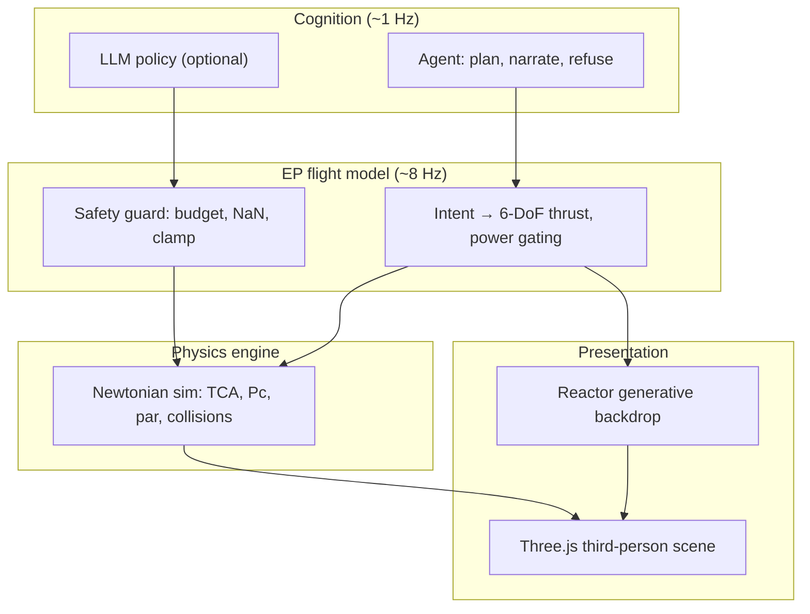

# Space-World (DRIFT 3D)

**An autonomous ion-probe agent in a third-person Newtonian space sim — resolve dual conjunction threats with minimum delta-v, while a live generative world streams behind the scene.**

[](LICENSE)
[](package.json)

DRIFT 3D is a playable space-traffic-management simulator and research substrate. You watch (or fly) a low-thrust electric-propulsion probe that must **protect a non-maneuvering ally satellite** and **avoid an incoming asteroid**, using the **least delta-v** possible. A deterministic physics engine is the safety net under any LLM policy; a headless Python port provides golden-parity benchmarks for RL and agent research.

---

## Table of contents

- [Overview](#overview)
- [Features](#features)
- [Quick start](#quick-start)
- [Configuration](#configuration)
- [Controls](#controls)
- [Gameplay](#gameplay)
- [Architecture](#architecture)
- [Server API](#server-api)
- [Development](#development)
- [Testing & evaluation](#testing--evaluation)
- [Research substrate](#research-substrate)
- [Project structure](#project-structure)
- [Documentation](#documentation)
- [License](#license)

---

## Overview

Space-World combines three layers:

| Layer | Role |
|---|---|
| **Physics engine** | Authoritative 3D Newtonian sim: probe, ally, asteroid(s), TCA, miss distance, probability of collision (Pc), delta-v ledger, and an analytic optimal burn ("par") |
| **3D presentation** | Three.js third-person scene with HUD, uncertainty ellipses, campaign levels, and synthesized audio |
| **Generative backdrop** | [Reactor](https://docs.reactor.inc/) streams a navigable world behind the sim, synced to flight controls; falls back to a procedural starfield offline |

The agent plans impulsive burns under a **12 m/s delta-v budget**. You can grab manual control at any time, fly the probe with WASD thrust, then hand control back. The autopilot runs by default; switch to an LLM brain when a Gemini key is configured.

**Design principle:** realism is always a toggle, never a replacement for playable feel. The deterministic layer is non-negotiable under any LLM.

---

## Features

### Simulation & STM credibility

- **Dual-threat conjunction resolution** — protect ally + avoid asteroid simultaneously
- **Multi-threat screening** — debris fields with N additional objects
- **Probability of collision (Pc)** in the B-plane with 3×3 position covariance propagation
- **Par optimizer** — analytic minimum-delta-v burn targeting Pc &lt; 10⁻⁴
- **Clohessy–Wiltshire dynamics** — optional orbital realism mode (linear at n=0)
- **TLE ingestion** — SGP4 conjunction pipeline via `satellite.js` (Node/CLI)
- **Seeded PRNG** — fully reproducible scenarios and benchmark runs

### Autonomy & safety

- **Deterministic autopilot** — min-delta-v planner with refusal logic and narration
- **LLM policy** — Gemini via server-side proxy, routed through a safety guard
- **Control handoff** — agent ↔ human with per-owner delta-v accounting
- **Policy benchmark** — optimal / heuristic / random / null across N seeds

### Presentation

- **Third-person Three.js scene** — probe, ally, asteroid meshes, reticles, uncertainty rings
- **Reactor generative backdrop** — lingbot (WASD-navigable) or helios (prompt-only)
- **EP flight model** — power-from-light gating, xenon budget, time-warp for playability
- **Campaign mode** — four levels, letter grades (A–F), localStorage leaderboard
- **Synthesized audio** — thruster, alert, eclipse drone, resolution chimes
- **WebXR** — VR button when a headset is present

### Research

- **Python Gymnasium environment** — byte-parity with the JS engine (11/11 golden tests)
- **26k+ labeled dataset** — behavior-cloning export with oracle labels
- **BC + PPO training**, ablations, curriculum, faithfulness benchmarks
- **Headless sim core** — runs in Node without a browser

---

## Quick start

### Prerequisites

- **Node.js ≥ 18**
- Optional: **Reactor API key** (live generative backdrop)
- Optional: **Gemini API key** (LLM narration and brain mode)

### Install & run

```bash
git clone https://github.com/atulkumarf9t/Space-World.git
cd Space-World
npm install
npm run build          # bundle Reactor SDK → vendor/reactor.bundle.mjs
node server/proxy.js   # → http://localhost:5173
```

The game runs **fully offline** without API keys — procedural starfield, deterministic autopilot, no narration proxy.

### Optional: configure API keys

```bash
cp .env.example .env
```

Edit `.env` with your keys (see [Configuration](#configuration)). Restart the server.

### Vite dev path (alternative)

```bash
# Terminal 1 — API server (token minting, Gemini proxy)
node server/proxy.js

# Terminal 2 — Vite dev server with HMR
npm run vite           # → http://localhost:5174 (proxies /api to :5173)
```

Production bundle:

```bash
npm run vite:build     # → dist/
```

---

## Configuration

Copy `.env.example` to `.env`. All variables are optional.

| Variable | Description |
|---|---|
| `REACTOR_API_KEY` | Server mints a short-lived JWT via `POST /api/reactor-token`. Key never reaches the browser. [Reactor auth docs](https://docs.reactor.inc/authentication) |
| `GEMINI_API_KEY` | Advisory narration and LLM brain mode via server-side proxy |
| `GEMINI_MODEL` | Default: `gemini-2.5-flash` |
| `PORT` | Static server port. Default: `5173` |
| `REACTOR_INSECURE_TLS` | Set to `1` to disable TLS verification for Reactor (dev only) |

### Reactor models

| Model | URL param | Behavior |
|---|---|---|
| **lingbot** (default) | — | WASD-navigable backdrop, flight-synced controls |
| **helios** | `?model=helios` | Prompt-only streaming; no WASD navigation ([Helios docs](https://docs.reactor.inc/model-api-reference/helios/overview)) |

> **Security:** Never commit `.env`. API keys stay server-side; the browser only receives short-lived Reactor JWTs.

---

## Controls

| Input | Action |
|---|---|
| `G` / **GRAB CONTROL** | Toggle manual control (agent ↔ you) |
| `W` / `S` | Forward / back thrust |
| `A` / `D` | Strafe left / right |
| `Q` / `E` | Down / up thrust |
| `R` | Reset and run a new encounter |
| **BRAIN** button | Switch autopilot ↔ LLM (requires `GEMINI_API_KEY`) |
| **BENCHMARK** button | Run policy scorecard off-thread (Web Worker) |

Ion thrust is intentionally gentle — plan burns early. Coasting is free; thrusting costs delta-v.

---

## Gameplay

### Mission

You command a **solar-electric ion probe**. A **non-maneuvering ally satellite** and an **incoming asteroid** are on converging passes. Resolve **both** threats — keep each outside the **0.50 km safe ring** — using the **least delta-v**.

### Phases

```
CRUISE → ALERT → RESOLVE → scorecard
```

1. **Cruise** — autopilot holds; conjunction metrics update in the side panel
2. **Alert** — Pc exceeds threshold; agent announces plan and begins burns
3. **Resolve** — both threats clear the safe ring, or collision / budget failure
4. **Grade** — A/B/C/F based on delta-v efficiency vs par

### Campaign levels

| Level | Challenge |
|---|---|
| **First Contact** | One ally, one asteroid — learn the controls |
| **Debris Field** | Two extra debris threats to screen |
| **Orbital Curve** | Clohessy–Wiltshire curved motion |
| **Gauntlet** | Three debris + curved orbital motion |

Stars and grades persist in `localStorage`.

### HUD panels

- **Conjunction** — worst miss, Pc, TCA, ally status
- **Δv ledger** — used vs par, efficiency ratio, agent vs human split
- **EP console** — power (from scene luminance), thrust, xenon, time-warp
- **Reasoning feed** — agent narration and handoff messages

---

## Architecture



### Core modules

| Module | Role |
|---|---|
| `src/physics.js` | Authoritative sim: probe/ally/asteroid, TCA, miss, Pc, par, delta-v ledger |
| `src/dynamics.js` | Clohessy–Wiltshire orbital dynamics (realism toggle) |
| `src/flight_model.js` | EP transfer function: 6-DoF thrust, power-from-light gating |
| `src/simulation.js` | Headless core — no DOM, runs in Node and Web Workers |
| `src/policies.js` | Optimal / heuristic / random / null / LLM policies + safety guard |
| `src/agent.js` | Dual-threat cognition, narration, handoff logic |
| `src/orchestrator.js` | Three loops (8/10/1 Hz), phase machine, campaign integration |
| `src/scene3d.js` | Three.js render + Reactor VideoTexture backdrop |
| `src/world_client.js` | Reactor SDK wrapper + flight-synced control messages |
| `src/overlay.js` | HUD reticles, threat panel, delta-v gauge, grade card |
| `src/campaign.js` | Level progression + localStorage leaderboard |
| `server/proxy.js` | Static server + Gemini/Reactor API proxies |

### Loop rates

| Loop | Rate | Responsibility |
|---|---|---|
| Flight model | 8 Hz | Thrust commands, EP state, shadow power gating |
| Pixel sense | 10 Hz | Luminance → power authority; obstacle reflexes |
| Cognition | 1 Hz | Planning, narration, LLM decisions |

---

## Server API

The Node proxy (`server/proxy.js`) serves static files and proxies external APIs so keys never reach the browser.

| Endpoint | Method | Description |
|---|---|---|
| `/api/config` | GET | `{ gemini: bool, reactor: bool }` — which services are configured |
| `/api/reactor-token` | POST | Mint short-lived Reactor JWT from server-side API key |
| `/api/gemini` | POST | Proxy Gemini completion requests |
| `/api/agent` | POST | LLM policy endpoint for in-app brain mode |

---

## Development

### npm scripts

| Script | Description |
|---|---|
| `npm start` / `npm run dev` | Start proxy server on `PORT` (default 5173) |
| `npm run build` | Bundle Reactor SDK → `vendor/reactor.bundle.mjs` |
| `npm test` | Run all Node test suites (39 assertions) |
| `npm run eval` | Policy benchmark over 200 seeded encounters |
| `npm run typecheck` | TypeScript `checkJs` on the engine core |
| `npm run vite` | Vite dev server on :5174 |
| `npm run vite:build` | Production bundle → `dist/` |

### Run paths

| Path | Command | Notes |
|---|---|---|
| **Native ESM** | `node server/proxy.js` | Import map + prebuilt `vendor/reactor.bundle.mjs` |
| **Vite dev** | `node server/proxy.js` + `npm run vite` | HMR, bundles from `node_modules` |
| **Vite prod** | `npm run vite:build` | Output in `dist/` |

Rebuild the vendor bundle after updating `@reactor-team/js-sdk`:

```bash
npm run build
```

---

## Testing & evaluation

### Unit tests

```bash
npm test
```

| Suite | File | Covers |
|---|---|---|
| Physics | `test/physics.test.mjs` | Golden math, Monte-Carlo Pc validation |
| Dynamics | `test/dynamics.test.mjs` | CW ≡ linear at n=0 |
| Multi-threat | `test/multithreat.test.mjs` | N-object screening |
| Campaign | `test/campaign.test.mjs` | Level progression logic |
| TLE | `test/tle.test.mjs` | SGP4 conjunction pipeline |

### Policy benchmark

```bash
npm run eval              # 200 encounters (default)
node eval/run.mjs 500     # custom N
```

Example output:

```
policy     success  collisions  unsafe  avg Δv  avg Δv/par  max Δv  over-budget
optimal    98.5%    0           1       4.21    1.06x       11.8    0
heuristic  95.0%    2           8       8.44    2.27x       12.0    0
random     87.5%    5           12      9.12    2.88x       12.0    0
null       62.0%    38          0       0.00    —           0.00    0
```

The deterministic guard guarantees **zero over-budget** burns for every policy.

### Type checking

```bash
npm run typecheck
```

---

## Research substrate

The `research/` directory is a **golden-parity Python port** of the JS engine, wrapped as a Gymnasium environment for RL, BC, and LLM agent benchmarks.

### Install & reproduce

```bash
cd research
pip install -e ".[all]"    # numpy + torch + gymnasium
python run_all.py            # parity + env gates + all benchmarks
```

### Cross-language parity

```bash
node research/gen_ref.mjs       # emit reference values from JS
python research/test_parity.py  # 11/11: Python matches JS to fp tolerance
```

### Gymnasium usage

```python
import gymnasium as gym
import drift_env

env = gym.make("Drift-v0")  # or DriftInstruct-Protect-v0 / DriftInstruct-Conserve-v0
obs, info = env.reset(seed=1234)
obs, reward, terminated, truncated, info = env.step([0.4])  # scalar Δv burn
```

### Headline research metrics

| Metric | Definition |
|---|---|
| **Regret vs par** | `Δv_used / par_Δv` — optimality gap (primary) |
| **Safety violations** | Actions the shield had to clamp |
| **Faithfulness** | Fraction of LM rationales matching true decision driver |

See [`research/README.md`](research/README.md), [`research/REPORT.md`](research/REPORT.md), and [`RESEARCH_ROADMAP.md`](RESEARCH_ROADMAP.md) for full track details, datasets, and result tables.

---

## Project structure

```
Space-World/
├── index.html              # App shell + HUD layout
├── src/                    # Browser + headless sim core
│   ├── physics.js          # Authoritative conjunction engine
│   ├── simulation.js       # Headless runner (Node / Worker)
│   ├── orchestrator.js     # Main app loop
│   ├── agent.js            # Autopilot cognition
│   ├── scene3d.js          # Three.js presentation
│   └── ...
├── server/
│   ├── proxy.js            # Static server + API proxies
│   └── build_vendor.mjs    # Reactor SDK bundler
├── test/                   # Node unit tests
├── eval/                   # Policy benchmark harness
├── research/               # Python Gymnasium substrate
│   ├── drift_env/          # Engine, env, policies, dataset
│   ├── data/               # Train/val/test JSONL (26k+ decisions)
│   └── run_all.py          # One-command reproduction
├── vendor/                 # Prebuilt Reactor browser bundle
├── dist/                   # Vite production output
├── ROADMAP.md              # Product roadmap & phase status
├── RESEARCH_ROADMAP.md     # Research track plan & results
└── DRIFT_architecture_v2.md  # Deep architecture narrative
```

---

## Documentation

| Document | Contents |
|---|---|
| [ROADMAP.md](ROADMAP.md) | Product phases: STM credibility, autonomy, polish |
| [RESEARCH_ROADMAP.md](RESEARCH_ROADMAP.md) | Research tracks A1–E2, dependency graph, status |
| [research/README.md](research/README.md) | Python env install, parity, baselines |
| [research/REPORT.md](research/REPORT.md) | Technical report with full result tables |
| [research/RELEASE.md](research/RELEASE.md) | Release contents and headline numbers |
| [DRIFT_architecture_v2.md](DRIFT_architecture_v2.md) | v2 design: EP as transfer function, perception split |

---

## License

MIT — see [package.json](package.json). Research dataset is regenerable from seeds; redistribute freely.

---

## Acknowledgments

Built with [Three.js](https://threejs.org/), [Reactor](https://reactor.inc/), and [satellite.js](https://github.com/shashwatak/satellite-js). DRIFT was originally developed for the *Agents in Worlds* track at Inception (Launchd × Interact Studio), Bengaluru, June 2026.
